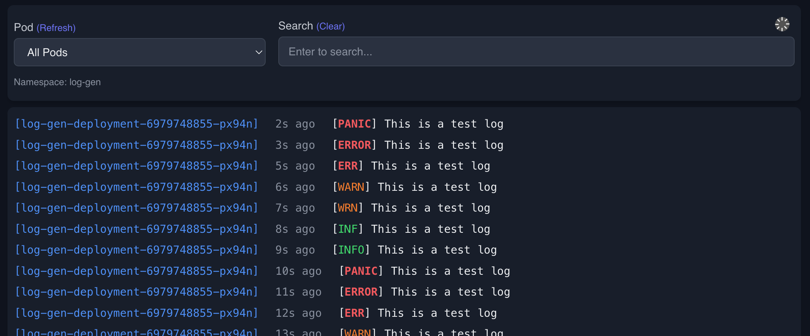

# Kube Web Log Viewer<!-- omit in toc -->

A simple Kubernetes log viewer web app. View logs from pods in your cluster with a simple web UI.

This application is explicity designed to only monitor logs from pods in the namespace it is deployed to.

It was created to help engineers to be able to monitor the logs of their pods in a namespace without having access to the cluster.



## Table of Contents<!-- omit in toc -->

- [Features](#features)
- [Requirements](#requirements)
- [Deploying](#deploying)
  - [Previous Pod Logs](#previous-pod-logs)
- [Contributing](#contributing)
- [Development](#development)

## Features

- List pods in a namespace
- View and search logs from selected pods
- Sort logs (newest/oldest first)
- Follow logs (auto-refresh)
- Automatically select pod if only one is running
- Highlight log levels (error, warning, info)
- Light/dark theme toggle
- Tailwind CSS for styling
- Modern web UI
- Flask for web server

## Requirements

- Python 3.11+
- [Flask](https://flask.palletsprojects.com/)
- [kubernetes](https://github.com/kubernetes-client/python)

## Deploying

1. Modify [the app config](kube-web-log-viewer.yaml). See comments on the API key usage
2. Create the configmap:

    ```sh
    kubectl create configmap kube-web-log-viewer \
      --from-file=app.py \
      --from-file=log_archiver.py \
      --from-file=index.html \
      --from-file=pyproject.toml \
      -n YOUR_NAMESPACE
    ```

3. Apply the main manifest:

    ```sh
    kubectl apply -f kube-web-log-viewer.yaml -n YOUR_NAMESPACE
    ```

4. Port-forward to the service:

    ```sh
    kubectl port-forward -n YOUR_NAMESPACE svc/kube-log-viewer-service 5001:5001
    ```

The API key is desinged to simply protect the UI from random users. Please use a VPN or other means to protect the app in sensitive environments. Happy to accept PRs to add more security.

When using an API key, you embed the key in the URL. You can access the app at `http://localhost:5001/api_key=your-api-key`

### Previous Pod Logs

By default, this application stores logs for all pods in the namespace it is deployed to for 7 days.

This is configurable by setting the `MAX_LOG_RETENTION_MINUTES` environment variable in the deployment configuration.

Or disable it by setting `RETAIN_ALL_POD_LOGS=false` in the deployment configuration.

When enabled:

- Logs from all pods are stored in the `/logs` directory in the container
- Logs are automatically cleaned up after the configured retention period (default: 7 days)
- Old pod logs can be accessed through the web UI in the pod selection dropdown under "Previous Pods"
- The retention period can be configured via `MAX_LOG_RETENTION_MINUTES` environment variable
- The deployment uses emptyDir for the logs directory, so logs are not persisted across pod restarts


## Contributing

We welcome contributions! Please follow these guidelines when submitting a Pull Request:

1. Fork the repository and create your feature branch (`git checkout -b feature/amazing-feature`)
2. Make your changes
3. Test your changes, consider using the [test-pod.yaml](tests/test-pod.yaml) to test the app
   1. Feel free to make better tests
4. Run code formatting and linting:
   ```sh
   # Format code with black
   uvx black .
   # Run ruff linter
   uvx ruff check --fix .
   ```
5. Commit your changes with a descriptive commit message
6. Push to your branch (`git push origin feature/amazing-feature`)
7. Open a Pull Request

Pull Request Guidelines

- Keep PRs focused and small when possible
- Update documentation for any new features
- Follow the existing code style
- Use clear commit messages that describe the changes
- Reference any related issues in your PR description


## Development

Testing is done with [Playwright](https://playwright.dev/).

The tests assume that the test "log-gen" pod is running in the namespace where the app is deployed.

To install development dependencies:

```sh
uv pip install -e ".[dev]"
```

To run the tests:

```sh
uv run pytest
```
